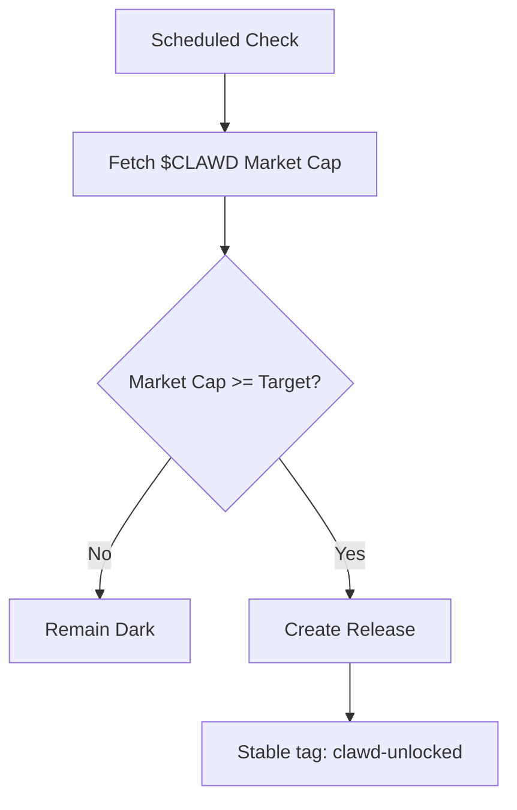
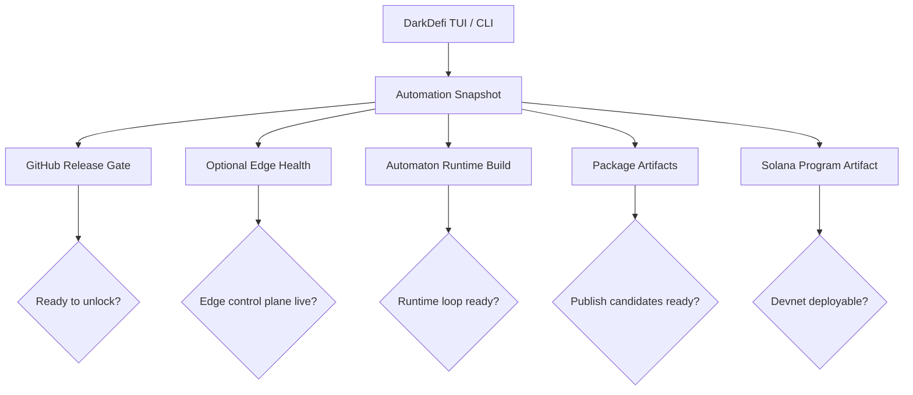
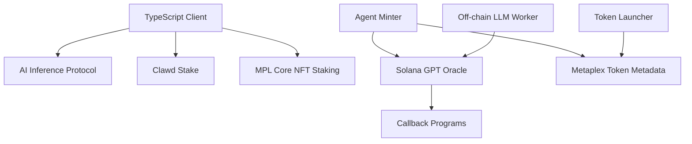

<p align="center">
  
</p>

<p align="center">
  
</p>

<h1 align="center">DarkDefi</h1>

<p align="center">
  <strong>cypherpunk lobster automation on Solana.</strong>
</p>

<p align="center">
  <a href="#installation">Installation</a> •
  <a href="#usage">Usage</a> •
  <a href="#420-release-window">4:20 Release</a> •
  <a href="#solana-programs">Solana Programs</a> •
  <a href="#packages">Packages</a> •
  <a href="#deployment">Deployment</a> •
  <a href="#codebase-map">Codebase Map</a> •
  <a href="#architecture">Architecture</a> •
  <a href="#interoperability">Interoperability</a> •
  <a href="#open-source-safety">Open Source Safety</a> •
  <a href="#contributing">Contributing</a> •
  <a href="#security">Security</a>
</p>

<p align="center">
  
  
  
  
  
</p>

---

DarkDefi is an autonomous Solana operations room for Dark Ralph, Clawd commit context, market-gated releases, agent terminals, and an on-chain program mesh.

```text
               DARKDEFI CONTROL ROOM

  market data  ->  release gate  ->  GitHub release
       |              |                  |
       v              v                  v
  Birdeye fail   automation TUI     clawd-unlocked
  closed check   readiness board    stable tag

       Solana program mesh: stake, infer, mint, launch, oracle
```

The system watches `$CLAWD` through Birdeye. If the market cap reaches `$100,000`, the release gate opens and the stable `clawd-unlocked` release is created. Until then, local tools, package artifacts, and Solana program state stay visible through the TUI and CLI.

## Operator View

| Station | What it gives you |
| --- | --- |
| Release gate | A fail-closed market-cap check for `$CLAWD`, backed by GitHub Actions. |
| Automation board | One readiness snapshot for workflows, package artifacts, edge health, runtime builds, and Solana program state. |
| Solana mesh | Program IDs, deployment status, costs, and communication paths for the Anchor and client surfaces in `programs/`. |
| Agent terminal | TUI/CLI routes for Dark Ralph, Clawd context, Solana data, wallet helpers, and guarded local tools. |
| Public handoff | GitHub release metadata, docs, threat model, and reproducible package artifacts. |

## 4:20 Release Window

The public lobster launch is set for:

```text
May 8, 2026 at 4:20 PM Eastern
May 8, 2026 at 20:20 UTC
```

GitHub READMEs do not run JavaScript, so the animated countdown lives as a GitHub-safe SVG banner above. The executable release timer lives in `.github/workflows/cypherpunk-lobster-release.yml` and is guarded to this exact date.

## Features

- **Autonomous release control**: Market-cap gated GitHub release workflow
- **Cypherpunk lobster release window**: One-time 4:20 PM Eastern GitHub release automation
- **Fail-closed market data**: Birdeye checks reject missing secrets, invalid targets, malformed token addresses, bad payloads, timeouts, and unusable market-cap fields
- **Stable release artifact**: A single `clawd-unlocked` tag prevents repeated scheduled releases after the threshold is crossed
- **Automation control plane**: TUI and CLI loop readiness across GitHub release gate, external edge health endpoints, package artifacts, automaton runtime, and Solana program state
- **Solana integration**: Native support for Solana token intelligence and program references
- **Program mesh client**: Frontend-safe devnet program IDs, Solscan links, deployment checks, and PDA helpers
- **Program inventory**: A maintained Solana map with program IDs, deployment evidence, deploy balances, runtime costs, and cross-program communication paths
- **Agentic architecture**: Autonomous loop primitives, terminal interfaces, and deployable API surfaces
- **Security baseline**: CI, CodeQL, Dependabot, CODEOWNERS, responsible disclosure policy, and threat model

## Installation

### Prerequisites

- Node.js >= 18.0.0
- Bun >= 1.0.0 (recommended)
- Git

### Clone and Setup

```bash
git clone https://github.com/x402agent/DarkDefi.git
cd DarkDefi
bun install
bun run build
```

### Configuration

No `.env` files belong in this repo. Configure secrets in GitHub Actions only.

Required GitHub secrets:
- `BIRDEYE_API_KEY`: Your Birdeye API key
- `CLAWD_TOKEN_ADDRESS`: The Solana token address for $CLAWD

Optional GitHub variables:
- `CLAWD_MARKET_CAP_TARGET`: Market cap threshold (default: 100000)

## Usage

### Local Development

```bash
# Start the TUI
bun run dev

# Build for production
bun run build

# Run tests
bun run test
```

### Automation Control Plane

DarkDefi's main operator surface is the automation loop board. It turns the repo, package artifacts, optional edge health endpoints, release gate, automaton runtime, and Solana program into one readiness snapshot.

```bash
# Full automation readiness report
bun run src/cli.tsx automation

# API key and automation health summary
bun run src/cli.tsx status
```

When running the packaged CLI outside the repo, point it at the checkout:

```bash
DARKDEFI_ROOT=/path/to/DarkDefi dark-ralph automation
```

Inside the TUI, press `6` to open `AUTOMATION`. From the command console, use:

```text
/automation
/release-gate
/status
```

Current loop states are intentionally conservative:

| Loop | Ready condition |
| --- | --- |
| `$CLAWD Release Gate` | GitHub workflow exists and `BIRDEYE_API_KEY` plus `CLAWD_TOKEN_ADDRESS` are configured. |
| `Agent API Edge Control Plane` | Optional staging and production edge `/health` checks return success when URLs are configured. |
| `Automaton Runtime Loop` | `automaton-main/dist/index.js` exists after `pnpm build`. |
| `Package Release Candidates` | Public tarballs exist under `artifacts/packages/`. |
| `Solana Program Mesh` | Deployable program accounts are checked on devnet and surfaced in the TUI automation view. |

### Autonomous Release Gate

The release gate monitors `$CLAWD` market cap every 30 minutes.

#### Manual Trigger

```bash
gh workflow run autonomous-release.yml
```

#### Local Dry Run

```bash
BIRDEYE_API_KEY=... CLAWD_TOKEN_ADDRESS=... node scripts/check-clawd-market-cap.mjs
```

The checker fails closed when keys are missing, Birdeye is unreachable, or market cap cannot be determined.

### Verification

```bash
bun run typecheck
bun run lint
bun run test
bun run build
bun run build:lib
```

Subsystem verification:

```bash
cd automaton-main && pnpm test && pnpm build
cd ../clawd-tui && npm run typecheck
cd ../programs && cargo check
cd client && npm run build
```

## Solana Programs

DarkDefi treats `programs/` as the canonical Solana program mesh. The detailed, checked inventory lives in [programs/README.md](programs/README.md); the table below is the main operator view.

Deployment status was checked on 2026-05-08 with `solana program show` against devnet and mainnet-beta. Cost is either the live upgradeable program balance or a local rent estimate for a built artifact.

| Surface | Path | Program ID | Devnet | Mainnet-beta | Cost / balance | Role |
| --- | --- | --- | --- | --- | --- | --- |
| AI inference protocol | `programs/solana-ai-inference/` | `3xFBRCtk5hxeLWzHvwyDg2B67RHoA9JFTKmHPzzccBVc` | Not found | Not found | Local deploy estimate: 3.06217728 SOL | Model registry, validator staking, inference requests, fees, DNA/data submissions, slashing, and rewards. |
| Clawd stake | `programs/clawd-stake/` | `5bp3bDnWYdjiYyB99XWWi6h8ga2wnB1TxuRUb4VNJrTn` | Deployed | Not found | Devnet balance: 2.4095868 SOL | Agent/Core asset staking, CLAWD rewards, position state, and SOL gacha-fee sharing. |
| MPL Core NFT staking | `programs/mpl-corenft-staking/` | `7AFH2R2vAowRbYxLJnS5eRazZxQyHcMD9VTJKEFsjpdZ` | Deployed | Not found | Devnet balance: 2.06253336 SOL | Minimal Core NFT staking registry for owner, asset, collection, and global count. |
| Agent minter | `programs/agent-minter/` | `agnmDKzZkv63sRhPFvm3iWpxaopgTRcohXA6CSYSXvQ` | Deployed | Deployed | Devnet: 2.79984792 SOL; mainnet: 2.80107288 SOL | Reference AI-agent token minter that calls the GPT oracle and mints through callbacks. |
| Solana GPT oracle | `programs/solana-gpt-oracle/` | `LLMrieZMpbJFwN52WgmBNMxYojrpRVYXdC1RCweEbab` | Deployed | Deployed | Devnet: 2.17144344 SOL; mainnet: 1.97984856 SOL | On-chain LLM context and callback router. |
| LLM oracle worker | `programs/llm_oracle/` | Uses `solana-gpt-oracle::ID` | Off-chain | Off-chain | RPC, OpenAI API, tx fees, priority fees | Watches oracle interactions, calls OpenAI, and submits callback transactions. |
| Token launcher | `programs/token-launcher/` | `funvWGBmpr8N7pTNqpxkWPgWnQbL3Yr5vzCHNJT2YkL` | Not found | Not found | No deployed account found | Token launchpad source for minting SPL tokens and creating metadata. |
| Token launch TS builder | `programs/solana-contracts/` | `TLaunDAP1sZks8dGmcNWHxdAgzMuiYzKg87mfjHRFzM` | Not found | Not found | No deployed account found | TypeScript instruction builder for a different token-launch program ID. |
| Token Metadata reference | `programs/mpl-token-metadata-main/` | `metaqbxxUerdq28cj1RbAWkYQm3ybzjb6a8bt518x1s` | External | External | External Metaplex program | Vendored reference used by metadata CPI paths. |
| Program client | `programs/client/` | Uses IDs above | Client-only | Client-only | Runtime only | TypeScript SDK for AI inference, ORE, config constants, and PDA helpers. |

The active top-level Anchor workspace currently builds `solana-ai-inference` and `clawd-stake`; standalone program folders keep their own configs or clients. The most important communication paths are:

| From | To | Link |
| --- | --- | --- |
| `client` | `solana-ai-inference`, `clawd-stake`, `mpl-corenft-staking` | Program constants, IDL, and PDA helpers. |
| `agent-minter` | `solana-gpt-oracle` | Anchor CPI into `create_llm_context` and `interact_with_llm`. |
| `llm_oracle` | `solana-gpt-oracle` | Program subscription and callback transactions. |
| `solana-gpt-oracle` | callback programs | Stores callback program ID, discriminator, and account metas, then invokes them. |
| `agent-minter`, `token-launcher` | Metaplex Token Metadata | Metadata account creation CPI. |

Known gaps are tracked in [programs/README.md](programs/README.md): `solana-ai-inference` is configured but not found on-chain, the token launcher has two conflicting IDs, and mainnet mappings for `clawd-stake` and `mpl-corenft-staking` do not resolve to deployed accounts.

Frontend and TUI consumers should import the public client helpers:

```ts
import {
  DARKDEFI_PROGRAM_IDS,
  createDarkDefiProgramConnection,
  deriveClawdStakePoolPda,
  deriveSolanaAiConfigPda,
  getDarkDefiProgramStatuses,
} from '@darkralph/tui';
```

Devnet deployment commands:

```bash
cd programs
cargo check
cargo build-sbf --manifest-path Cargo.toml

solana program deploy target/deploy/clawd_stake.so \
  --program-id target/deploy/clawd_stake-keypair.json \
  --url devnet \
  --upgrade-authority ~/.config/solana/id.json

solana program deploy target/deploy/solana_ai_inference.so \
  --program-id target/deploy/solana_ai_inference-keypair.json \
  --url devnet \
  --upgrade-authority ~/.config/solana/id.json
```

Current deployment note: `clawd-stake`, `mpl-corenft-staking`, `agent-minter`, and `solana-gpt-oracle` resolve on devnet. `agent-minter` and `solana-gpt-oracle` also resolve on mainnet-beta. `solana-ai-inference`, `token-launcher`, and the token-launch TypeScript builder IDs were not found on devnet or mainnet-beta during the 2026-05-08 check.

## Packages

DarkDefi is a multi-package repository. The source packages are the source of truth; tarballs are reproducible release candidates or reference artifacts.

| Package | Path | Type | Entry points | Ship status |
| --- | --- | --- | --- | --- |
| `@darkralph/tui@1.0.0` | `./` | Public npm CLI/TUI | `dark-ralph`, `ralph`, `ralph-tui` | Publish candidate: `artifacts/packages/darkralph-tui-1.0.0.tgz`. |
| `@conway/automaton@0.1.0` | `automaton-main/` | Public npm runtime and CLI | `automaton`, `conway-automaton` | Publish candidate: `artifacts/packages/conway-automaton-0.1.0.tgz`. |
| `@conway/automaton-cli@0.1.0` | `automaton-main/packages/cli/` | Workspace CLI package | `automaton-cli` | Source package in the automaton workspace; not currently packed as a standalone tarball. |
| `@openclawdsolana/clawd-tui@0.2.2` | `clawd-tui/` | Public npm CLI | `clawd`, `clawd-tui` | Publish candidate: `artifacts/packages/openclawdsolana-clawd-tui-0.2.2.tgz`. |
| `mpl-corenft-staking@0.1.0` | `mpl-corenft-staking/` | Anchor/Solana program | Program id `7AFH2R2vAowRbYxLJnS5eRazZxQyHcMD9VTJKEFsjpdZ` | Devnet deployed; no mainnet deploy attempted. |
| `@solana/mpp@0.2.0` | `mpp/solana-mpp-0.2.0.tgz` | Reference npm artifact | Tarball only | Tracked upstream/reference payment package artifact. |
| `@solana/mpp@0.5.0` | `mpp/solana-mpp-0.5.0.tgz` | Reference npm artifact | Tarball only | Tracked upstream/reference payment package artifact. |

### Artifact Inventory

| Artifact | Package | Status | Use |
| --- | --- | --- | --- |
| `artifacts/packages/darkralph-tui-1.0.0.tgz` | `@darkralph/tui@1.0.0` | Public npm candidate | Root Dark Ralph / DarkDefi TUI package. |
| `artifacts/packages/openclawdsolana-clawd-tui-0.2.2.tgz` | `@openclawdsolana/clawd-tui@0.2.2` | Public npm candidate | Solana-aware Clawd terminal package. |
| `artifacts/packages/conway-automaton-0.1.0.tgz` | `@conway/automaton@0.1.0` | Public npm candidate | Automaton runtime library and CLI. |
| `mpp/solana-mpp-0.2.0.tgz` | `@solana/mpp@0.2.0` | Reference artifact | Earlier Solana payment package snapshot. |
| `mpp/solana-mpp-0.5.0.tgz` | `@solana/mpp@0.5.0` | Reference artifact | Current Solana payment package snapshot used for interoperability review. |

`artifacts/`, generated `dist/` folders, dependency folders, private deployment folders, Cloudflare `.wrangler/` state, local config, and Solana deploy keypairs are ignored. Regenerate local outputs and attach only reviewed tarballs to public releases.

## Deployment

DarkDefi contains deployable JavaScript packages and an Anchor/Solana program reference. Public publishing and on-chain deployment require external credentials; local build artifacts can be produced without committing secrets.

### Package Artifacts

Build and pack the root TUI package:

```bash
bun run build
mkdir -p artifacts/packages
npm pack --pack-destination artifacts/packages
```

Build and pack nested packages:

```bash
cd automaton-main
pnpm install --frozen-lockfile
pnpm build
npm pack --pack-destination ../artifacts/packages

cd ../clawd-tui
npm ci
npm run build
npm pack --pack-destination ../artifacts/packages

```

Local package artifacts are written under `artifacts/packages/`, which is intentionally gitignored. Publishing to npm requires an authenticated npm account and should be done only after CI passes:

```bash
npm publish artifacts/packages/<package>.tgz --access public
```

If npm returns `E403` with a two-factor authentication requirement, publish with a current OTP or use a granular automation token that is allowed to publish:

```bash
NPM_CONFIG_OTP=123456 npm publish artifacts/packages/<package>.tgz --access public
```

Use these tarballs for final smoke tests, internal handoff, npm publishing, or GitHub release attachments. They are reproducible build outputs, not source of truth. Delete them any time and regenerate with the commands above.

### Solana Program

The main Solana workspace lives in `programs/`. Build the active top-level Anchor workspace from there:

```bash
cd programs
cargo check -p solana-ai-inference -p clawd-stake
cargo build-sbf --manifest-path Cargo.toml
```

Expected deploy artifacts:

```text
programs/target/deploy/clawd_stake.so
programs/target/deploy/solana_ai_inference.so
```

Deploy commands for the active workspace:

```bash
solana program deploy target/deploy/clawd_stake.so \
  --program-id target/deploy/clawd_stake-keypair.json \
  --url devnet \
  --upgrade-authority ~/.config/solana/id.json

solana program deploy target/deploy/solana_ai_inference.so \
  --program-id target/deploy/solana_ai_inference-keypair.json \
  --url devnet \
  --upgrade-authority ~/.config/solana/id.json
```

The standalone Core NFT staking registry also has its own root-level workspace:

```bash
cd mpl-corenft-staking
cargo build-sbf --manifest-path Cargo.toml
solana program deploy target/deploy/mpl_corenft_staking.so \
  --program-id target/deploy/mpl_corenft_staking-keypair.json \
  --url devnet \
  --upgrade-authority ~/.config/solana/id.json
```

If a new program keypair is generated, update the matching `declare_id!`, `Anchor.toml`, and TypeScript constants before deployment. Do not deploy with mismatched IDs; the clients derive PDAs from those IDs.

Current status: `clawd-stake`, `mpl-corenft-staking`, `agent-minter`, and `solana-gpt-oracle` resolve on devnet. `agent-minter` and `solana-gpt-oracle` also resolve on mainnet-beta. `solana-ai-inference` has a local deploy artifact but was not found on devnet or mainnet-beta during the 2026-05-08 check. See [programs/README.md](programs/README.md) for the full inventory and cost table.

## Codebase Map

| Path | Role | Public release notes |
| --- | --- | --- |
| `.github/` | Issue templates, PR template, CODEOWNERS, Dependabot, CI, CodeQL, and autonomous release workflow. | Keep workflow secrets in GitHub Actions only. |
| `assets/` | Public SVG banner and visual assets. | Safe to publish. |
| `src/` | Root Dark Ralph / DarkDefi TUI, CLI, market-data services, automation status board, wallet helper, and config schema. | Main public operator experience. |
| `scripts/` | Release-gate market-cap checker and tests. | Fails closed on missing secrets or bad market data. |
| `automaton-main/src/` | Agent loop, tool registry, x402/Conway client, heartbeat, wallet identity, replication, self-mod audit, state, survival, and setup modules. | Runtime package source for `@conway/automaton`. |
| `automaton-main/packages/cli/` | Workspace CLI wrapper and operational commands. | Workspace source; not separately packed yet. |
| `clawd-code-cli/` | Integration slot for the Clawd operator CLI source package. | README-only in this checkout. |
| `clawd-tui/src/` | Solana-aware Clawd CLI with Birdeye, Helius, OpenRouter/DeepSeek, OAuth, renderer, session, and guarded local file/shell tools. | Public package source for `@openclawdsolana/clawd-tui`. |
| `programs/` | Anchor workspace, program references, and TypeScript Solana client. | Canonical devnet program mesh; keep `target/`, keypairs, and generated outputs ignored. |
| `docs/` | Birdeye integration, interoperability contract, open-source release checklist, threat model, and public article draft. | Public documentation surface. |
| `mpl-corenft-staking/src/` | Anchor staking registry instructions, state, constants, and errors. | Devnet reference program; keep deploy keypairs ignored. |
| `mpp/` | Solana payment package reference artifacts and generated HTML asset source. | Review tarballs before release attachments. |
| `artifacts/packages/` | Local npm pack outputs. | Ignored; attach reviewed outputs only when cutting a release. |
| `cloudflare-agent-api/`, `config/` | Private/local deployment and token configuration surfaces. | Ignored and removed from GitHub tracking. |
| `dist/`, `node_modules/`, `.wrangler/`, `target/` | Generated build, dependency, provider, and Solana artifacts. | Ignored and should stay out of public source commits. |

## Architecture

### Core Systems

- **`src/`** - Dark Ralph TUI core
- **`automaton-main/`** - Autonomous loop primitives
- **`clawd-code-cli/`** - Integration slot for the Clawd operator CLI source package
- **`clawd-tui/`** - Solana-aware agent terminal with OpenRouter, Birdeye, Helius, and guarded local tools
- **`programs/`** - Canonical Anchor workspace, program inventory, oracle worker, and TypeScript SDK
- **`mpl-corenft-staking/`** - Standalone Anchor staking-registry workspace
- **`mpp/`** - Solana payment package artifacts
- **`docs/`** - Integration notes and public article drafts

Each deployable or public-facing subsystem has its own README with package, deploy, and safety boundaries.

### Release Gate Logic



### Automation Loop Logic



### Program Mesh Logic



## Interoperability

DarkDefi exposes its public automation state through GitHub release metadata rather than hidden local state. Downstream systems should watch the `clawd-unlocked` release, validate it against their own policy, and re-query their own data provider before any value-transfer action.

See [docs/INTEROPERABILITY.md](docs/INTEROPERABILITY.md) for the integration contract.

## Security

DarkDefi implements multiple security measures:

- **No Local Secrets**: All sensitive data managed via GitHub Secrets
- **Automated Scanning**: CodeQL security analysis on every push
- **Dependency Updates**: Weekly Dependabot updates
- **Fail-Safe Design**: Release gate fails closed on errors
- **Deterministic Releases**: Stable unlock tag prevents repeated scheduled releases
- **Audit Logging**: Comprehensive logging for all operations

See [SECURITY.md](SECURITY.md) and [docs/THREAT_MODEL.md](docs/THREAT_MODEL.md) for details.

## Open Source Safety

This repository is prepared to be public: local secrets, private deployment folders, local config, deploy state, generated artifacts, dependency folders, build outputs, and Solana keypairs are ignored.

Before publishing a release, run the checklist in [docs/OPEN_SOURCE_RELEASE.md](docs/OPEN_SOURCE_RELEASE.md).

## Contributing

We welcome contributions! Please see [CONTRIBUTING.md](CONTRIBUTING.md) for guidelines.

### Development Setup

```bash
# Install dependencies
bun install

# Run tests
bun run test

# Lint code
bun run lint

# Type check
bun run typecheck
```

## Operating Rule

DarkDefi does not promise profit, signal, or safety.

It is an agentic release machine with one public condition:

```
$CLAWD market cap >= $100,000
source: Birdeye
action: release
```

Until then, it remains dark.

## License

MIT License - see [LICENSE](LICENSE) for details.

## Disclaimer

This software is for educational and research purposes. Not financial advice. Use at your own risk.
