<div align="center">



[](https://solana.com)
[](https://anchor-lang.com)
[](https://rustlang.org)
[](LICENSE)
[](https://explorer.solana.com)

**Commitment-based privacy pool on Solana — shield, transfer, and withdraw SOL with on-chain encrypted notes.**

[Protocol](#protocol-overview) · [Instructions](#instructions) · [Architecture](#architecture) · [Quick Start](#quick-start) · [Deploy](#deployment) · [Security](#security)

</div>

---

## Protocol Overview

Dark Protocol implements a **shielded note pool** inspired by Zcash's Sapling design, ported natively to Solana as an Anchor program. Every deposited SOL becomes a **shielded note** — an on-chain encrypted blob that only the holder of the incoming viewing key (IVK) can read. No external prover infrastructure required for v1.

```
┌─────────────────────────────────────────────────────────────────────┐
│                        DARK PROTOCOL v1                             │
│                                                                     │
│   User Wallet                                                       │
│       │                                                             │
│       ▼                                                             │
│  ┌─────────┐   deposit(amount, commitment, enc_ct, out_ct, eph_key) │
│  │Depositor│──────────────────────────────────────────────────────► │
│  └─────────┘                                                        │
│                    ┌─────────────────────┐                          │
│                    │    Pool Vault PDA   │  ◄── SOL custody         │
│                    └─────────────────────┘                          │
│                    ┌─────────────────────┐                          │
│                    │   ShieldedNote PDA  │  ◄── encrypted note      │
│                    │  commitment: [u8;32]│      (790 bytes)         │
│                    │  enc_ct:  [u8;580]  │                          │
│                    │  out_ct:  [u8;80]   │                          │
│                    │  eph_key: [u8;32]   │                          │
│                    └─────────────────────┘                          │
│                                                                     │
│  shielded_transfer ──► spend note, emit 2 new notes (no SOL move)  │
│  withdraw          ──► nullifier reveals note, SOL exits vault      │
└─────────────────────────────────────────────────────────────────────┘
```

**Program ID:** `E8zL7h9qHjC7sMf2WCYhdqS5iLkYhPJ9yAhTfevo74jm`

---

## Instructions

### `initialize`
Bootstrap the global `ProtocolState` PDA and the native SOL pool vault.

| Account | Role |
|---|---|
| `protocol_state` | PDA `["protocol"]` — global counter + bumps |
| `pool_vault` | PDA `["pool_vault", protocol_state]` — SOL custody |
| `payer` | pays rent |

```typescript
await program.methods
  .initialize(authority)
  .accounts({ protocolState, poolVault, payer, systemProgram })
  .rpc();
```

---

### `deposit`
Shield SOL into the pool. Creates a `ShieldedNote` PDA keyed by commitment.

| Parameter | Type | Description |
|---|---|---|
| `amount` | `u64` | Lamports to shield (must be > 0) |
| `commitment` | `[u8; 32]` | Pedersen commitment to note value + nullifier key |
| `enc_ciphertext` | `[u8; 580]` | Sapling `enc_ciphertext` (ChaCha20-Poly1305) |
| `out_ciphertext` | `[u8; 80]` | Sapling `out_ciphertext` |
| `ephemeral_key` | `[u8; 32]` | Ephemeral public key for ECDH |

```typescript
await program.methods
  .deposit(amount, commitment, encCiphertext, outCiphertext, ephemeralKey)
  .accounts({ protocolState, shieldedNote, poolVault, depositor, systemProgram })
  .rpc();
```

Emits: `NoteDeposited { commitment, amount, note_index, slot }`

---

### `withdraw`
Redeem SOL by presenting a nullifier that proves note ownership. Marks the note `spent` and records the nullifier on-chain to prevent double-spend.

| Parameter | Type | Description |
|---|---|---|
| `nullifier` | `[u8; 32]` | Derived from note's nullifier key (PRF output) |
| `amount` | `u64` | Must match the note's stored amount |

```typescript
await program.methods
  .withdraw(nullifier, amount)
  .accounts({ protocolState, shieldedNote, nullifierRecord, poolVault, recipient, systemProgram })
  .rpc();
```

Emits: `NoteWithdrawn { nullifier, amount, slot }`

---

### `shielded_transfer`
Private payment: spend one input note and create two output notes (payment + change). **No SOL leaves the vault** — only note commitments rotate.

| Parameter | Type | Description |
|---|---|---|
| `input_nullifier` | `[u8; 32]` | Nullifies the input note |
| `output_commitment_1/2` | `[u8; 32]` | Commitments for recipient + change |
| `enc_ciphertext_1/2` | `[u8; 580]` | Encrypted notes for recipient + sender |
| `out_ciphertext_1/2` | `[u8; 80]` | Out ciphertexts |
| `ephemeral_key_1/2` | `[u8; 32]` | ECDH keys |
| `amount_1` | `u64` | Payment amount |
| `amount_2` | `u64` | Change amount (must sum to input note value) |

Emits: `NoteTransferred { input_nullifier, output_commitment_1, output_commitment_2, amount_1, amount_2 }`

---

## Architecture

### Account Layout

```
ProtocolState PDA  ["protocol"]                          50 bytes
├── authority:   Pubkey                                  32
├── note_count:  u64                                      8
├── bump:        u8                                       1
└── vault_bump:  u8                                       1

ShieldedNote PDA  ["note", commitment]                  790 bytes
├── commitment:    [u8; 32]                              32
├── enc_ciphertext [u8; 580]  ← Sapling enc_ciphertext  580
├── out_ciphertext [u8; 80]   ← Sapling out_ciphertext   80
├── ephemeral_key  [u8; 32]                              32
├── amount:        u64                                    8
├── spent:         bool                                   1
├── note_index:    u64                                    8
├── slot:          u64                                    8
├── depositor:     Pubkey                                32
└── bump:          u8                                     1

NullifierRecord PDA  ["nullifier", nullifier]            49 bytes
├── nullifier: [u8; 32]                                 32
├── slot:      u64                                        8
└── bump:      u8                                         1

Pool Vault PDA  ["pool_vault", protocol_state]
└── Native SOL account (no data)
```

### Note Lifecycle

```
                     ┌──────────────────┐
                     │  Unspent Note    │
   deposit() ───────►│  spent = false   │
                     └────────┬─────────┘
                              │
              ┌───────────────┴───────────────┐
              │                               │
              ▼                               ▼
     withdraw()                    shielded_transfer()
     nullifier revealed            nullifier revealed
     SOL exits vault               2 new notes created
              │                               │
              ▼                               ▼
     ┌─────────────────┐           ┌──────────────────────┐
     │  Note spent=true │          │  Note spent=true      │
     │  NullifierRecord │          │  NullifierRecord       │
     │  SOL → recipient │          │  OutputNote1 (payment)│
     └─────────────────┘          │  OutputNote2 (change) │
                                   └──────────────────────┘
```

### Encryption Model

Notes use **Sapling-compatible encryption**:

- Symmetric cipher: **ChaCha20-Poly1305** (client-side, SDK encrypts before sending)
- Key agreement: **ECDH** with ephemeral key (`ephemeral_key`)
- Recipient decryption: incoming viewing key (IVK) — chain is blind to content
- Merkle root: maintained **off-chain** by the SDK (avoids sha2 on-chain dependency)
- Double-spend prevention: **NullifierRecord PDA** — collision = tx fails at account init

---

## Quick Start

### Prerequisites

```bash
# Rust toolchain
curl --proto '=https' --tlsv1.2 -sSf https://sh.rustup.rs | sh

# Solana CLI
sh -c "$(curl -sSfL https://release.solana.com/stable/install)"

# Anchor CLI
cargo install --git https://github.com/coral-xyz/anchor anchor-cli --locked

# Node deps
yarn install
```

### Build

```bash
anchor build
```

### Test (localnet)

```bash
anchor test
```

### Run localnet manually

```bash
solana-test-validator &
anchor deploy
yarn run ts-mocha -p ./tsconfig.json -t 1000000 "tests/**/*.ts"
```

---

## Deployment

### Devnet

```bash
./deploy-devnet.sh
```

Checks balance, builds, extracts program keypair, and deploys. Explorer link printed on completion.

### Mainnet

```bash
./deploy-mainnet.sh
```

> Ensure your wallet at `~/.config/solana/id.json` has sufficient SOL for deployment (~2–3 SOL for program account rent).

### Configuration (`Anchor.toml`)

```toml
[programs.localnet]
dark_protocol_program = "E8zL7h9qHjC7sMf2WCYhdqS5iLkYhPJ9yAhTfevo74jm"

[provider]
cluster = "localnet"
wallet   = "~/.config/solana/id.json"
```

---

## Security

### Threat Model

| Attack | Mitigation |
|---|---|
| Double-spend | `NullifierRecord` PDA — account init fails if nullifier already used |
| Note forgery | Commitment binds to amount + nullifier key; mismatch → `AmountMismatch` error |
| Overflow | All arithmetic uses `checked_add` → `NoteOverflow` error |
| Replay | Slot timestamp recorded; nullifier PDA is permanent |
| Front-running | Encrypted ciphertext is opaque to validators |

### Known Limitations (v1)

- No zero-knowledge proof verification on-chain — trust is placed in the client SDK correctly computing commitments and nullifiers
- Merkle root managed off-chain — the on-chain state does not enforce note inclusion proofs
- Fixed ciphertext sizes (580 / 80 bytes) match Sapling spec; non-Sapling note formats are incompatible

### Audit Status

> v1 is unaudited. Do not use on mainnet with significant value without a professional audit.

---

## Project Structure

```
dark-protocol-program/
├── programs/
│   └── dark-protocol-program/
│       └── src/
│           └── lib.rs          ← program logic (single-file)
├── tests/
│   └── dark-protocol-program.ts
├── assets/
│   └── banner.svg
├── migrations/
├── deploy-devnet.sh
├── deploy-mainnet.sh
├── Anchor.toml
├── Cargo.toml
└── package.json
```

---

## Events

Subscribe via Anchor's `addEventListener` to track protocol activity:

```typescript
program.addEventListener("NoteDeposited", (event) => {
  console.log("New note:", event.noteIndex, "amount:", event.amount.toString());
});

program.addEventListener("NoteWithdrawn", (event) => {
  console.log("Nullifier revealed:", Buffer.from(event.nullifier).toString("hex"));
});

program.addEventListener("NoteTransferred", (event) => {
  console.log("Shielded tx: payment", event.amount1.toString(), "change", event.amount2.toString());
});
```

---

## Error Codes

| Code | Name | Message |
|---|---|---|
| 6000 | `ZeroAmount` | Amount must be greater than zero |
| 6001 | `NoteAlreadySpent` | Note has already been spent |
| 6002 | `AmountMismatch` | Amount does not match note value |
| 6003 | `NoteOverflow` | Note count overflow |

---

<div align="center">

Built on [Solana](https://solana.com) · Powered by [Anchor](https://anchor-lang.com) · Sapling note spec via [Zcash](https://zcash.github.io/orchard/)

</div>
